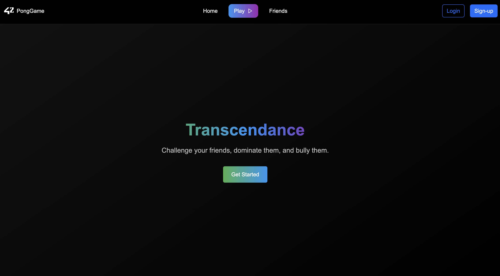
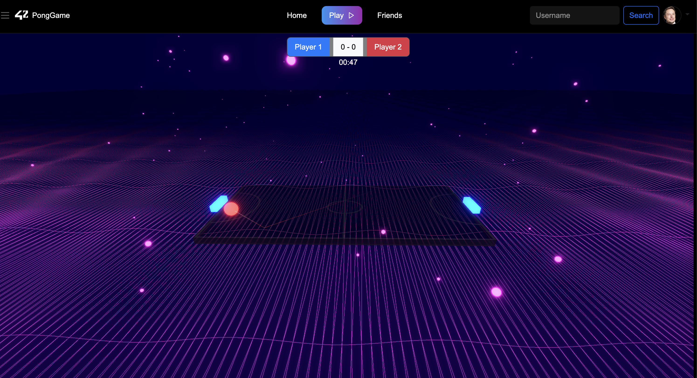
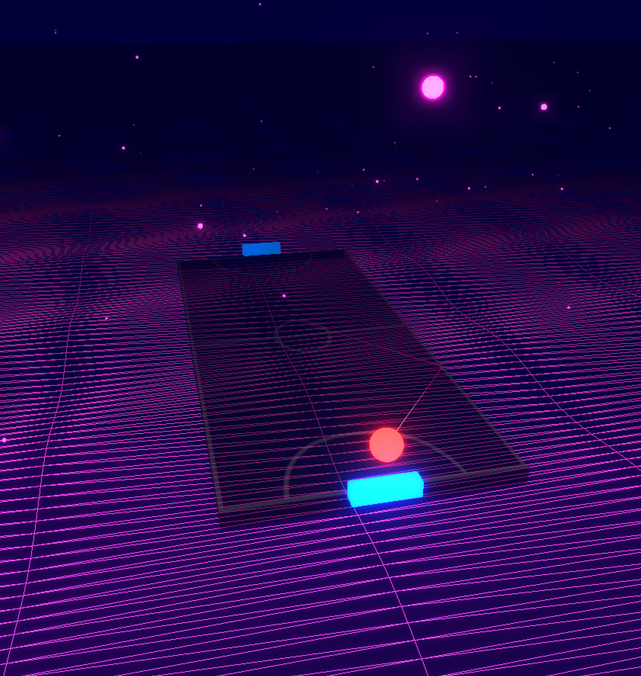

# Ping Pong Game Web Application

This is a Docker-based web application that implements a multiplayer ping pong game using Django backend, React frontend, PostgreSQL database, Redis cache, and Nginx reverse proxy.

## Project Structure

```
.
├── Makefile          # Build and deployment commands
├── docker-compose.yml # Docker container configuration
├── .env              # Environment variables
├── src/
│   ├── backend/      # Django application
│   ├── frontend/     # Frontend application
│   └── nginx/        # Nginx configuration
└── .data/           # Persistent data storage
```

## Game Features

- Real-time multiplayer ping pong gameplay
- WebSocket-based real-time communication
- Score tracking and game statistics
- User authentication and profile management
- Responsive design for desktop and mobile devices

## Services

- **Backend**: Django web application with WebSocket support (port 8000)
- **Frontend**: React application with canvas-based game rendering (port 3001)
- **Database**: PostgreSQL (port 5432) for user data and game history
- **Cache**: Redis (port 6378) for real-time game state management
- **Reverse Proxy**: Nginx (port 3000) for HTTPS termination and request routing

## Prerequisites

- Docker
- Docker Compose

## Getting Started

### 1. Create Environment File

Create a `.env` file in the root directory with required environment variables:

```env
# Database credentials
DB_NAME=pingpong_db
DB_USER=pingpong_user
DB_PASSWORD=pingpong_password
DB_HOST=db
DB_PORT=5432

# Django settings
SECRET_KEY=your_secret_key_here
DEBUG=True

# Redis settings
REDIS_URL=redis://redis:6379/0
```

### 2. Start the Application

```bash
make all
```

This will:
- Build all Docker images
- Start all containers in detached mode
- Run database migrations
- Show logs for the backend service

## Available Commands

```bash
make all        # Build, migrate, and start services
make build      # Build and start all containers
make logs       # Show backend service logs
make migrate    # Run Django migrations
make down       # Stop and remove containers
make re         # Restart the entire setup (down + up)
```

## Access the Application

- **Frontend**: http://localhost:3001
- **Backend API**: http://localhost:8000
- **Nginx (HTTPS)**: https://localhost:3000

## Game Preview






## Development

### Backend Development

To access the Django shell:
```bash
docker-compose exec backend python home_api/manage.py shell
```

To run Django commands:
```bash
docker-compose exec backend python home_api/manage.py [command]
```

### Frontend Development

The frontend is mounted as a volume, so changes will be reflected immediately.

## Directory Structure

- `src/backend/` - Django application code with game logic and API endpoints
- `src/frontend/` - React application code with game rendering and user interface
- `src/nginx/` - Nginx configuration files
- `.data/postgres/` - Persistent PostgreSQL data directory

## Troubleshooting

### Common Issues

1. **Port conflicts**: Make sure ports 3000, 3001, 5432, and 6378 are available
2. **Database connection issues**: Check your `.env` file credentials
3. **WebSocket connection failures**: Ensure Redis is running properly
4. **Build failures**: Try `make down` then `make all` to rebuild

### Viewing Logs

```bash
# View all service logs
docker-compose logs -f

# View specific service logs
docker-compose logs -f backend
docker-compose logs -f frontend
```

## Project Architecture

```
[Client] → [Nginx:443] → [Backend:8000]
                 ↓
          [Frontend:3001]
                 ↓
        [Database:5432] [Redis:6379]
```

The Nginx reverse proxy handles HTTPS termination and routes requests to the appropriate services. The backend manages game logic, user authentication, and WebSocket connections for real-time gameplay.

## Game Mechanics

- Players can create accounts and join games
- Real-time multiplayer gameplay with smooth physics
- Score tracking and win/loss statistics
- Lobby system for matchmaking
- Responsive controls for both desktop and mobile play
```